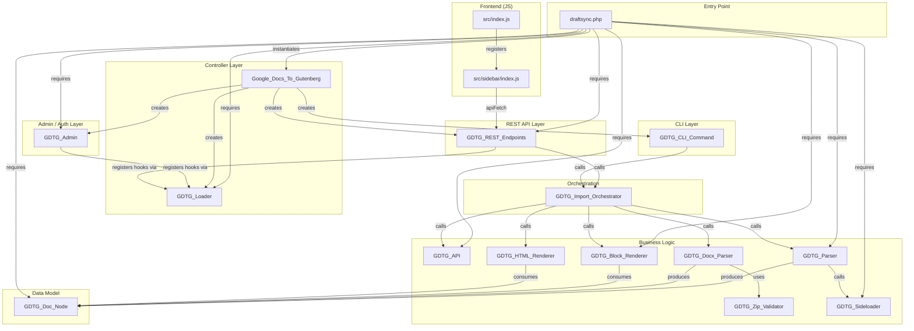
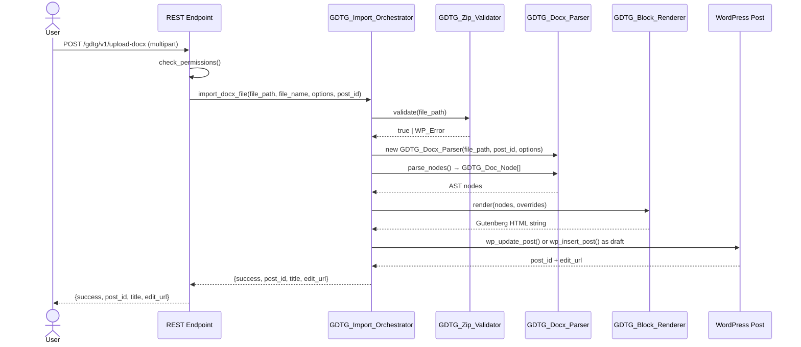

# DraftSync — Codebase Summary

## 1. File Inventory

### Root

| File | LOC | Purpose | Key APIs |
|---|---|---|---|
| `draftsync.php` | 111 | Main plugin loader. Defines constants, autoloads classes, bootstraps controller. | `GDTG_VERSION`, `GDTG_PATH`, `GDTG_URL`, `Google_Docs_To_Gutenberg` class |
| `package.json` | 26 | Node.js dependencies and build scripts. | `wp-scripts build/start`, `@wordpress/scripts` |
| `uninstall.php` | — | Plugin uninstall cleanup handler. Clears `wp_options` (all `gdtg_*` keys), deletes transients, and removes post meta (`_gdtg_*`) from all posts. | `GDTG_UNINSTALL` guard |
| `readme.txt` | — | WordPress.org plugin readme in WordPress readme standard format. Lists description, installation, FAQ, changelog, and WP.org metadata headers. | Standard WP readme |
| `LICENSE` | — | GNU General Public License v2.0 text. | GPL-2.0-or-later |
| `.distignore` | — | WP.org distribution ignore rules. Excludes dev/test tooling, build artifacts, docs, and CI config from plugin ZIP. | `wp dist-archive` compat |
| `languages/draftsync.pot` | — | Translation template for the `draftsync` text domain. Generated from `__()` / `esc_html__()` calls across all PHP files. | `wp i18n make-pot` |

### `includes/` — PHP Backend

| File | LOC | Purpose | Key APIs |
|---|---|---|---|
| `class-gdtg-loader.php` | 70 | Centralized hook registrar. Collects actions/filters, binds them to WordPress in `run()`. | `add_action()`, `add_filter()`, `run()` |
| `class-gdtg-admin.php` | 785 | Admin settings dashboard, OAuth callback handling, Gutenberg script enqueuing, Imported Docs manager, global style defaults, and auto-sync settings. | `register_admin_menu()`, `register_settings()`, `handle_oauth_redirect()`, `enqueue_editor_assets()`, `render_dashboard()`, `is_saas_bridge_available()` |
| `class-gdtg-api.php` | 686 | Google API client and OAuth bridge proxy. Token lifecycle for SaaS/Direct OAuth modes (OAuth access/refresh tokens stored encrypted via `GDTG_Secret_Store` with auto-migration of legacy plaintext). Configurable bridge base URL via `saas_bridge_base_url()`. | `get_access_token()`, `fetch_google_doc($doc_id)`, `get_drive_file_metadata($file_id)`, `fetch_drive_file($file_id)`, `refresh_saas_token()`, `force_refresh_token()`, `export_google_doc_as_html($doc_id)`, `validate_b...
| `class-gdtg-parser.php` | 566 | Stateful parser engine. Translates Google Docs JSON into `GDTG_Doc_Node[]` AST. | `parse()` → Gutenberg HTML string, `parse_nodes()` → `GDTG_Doc_Node[]` |
| `class-gdtg-docx-parser.php` | 571 | Namespace-aware OOXML parser. Extracts document.xml from .docx ZIP and produces `GDTG_Doc_Node[]` AST. List numbering resolution, heading style detection, hyperlink security. | `__construct($file_path, $post_id, $options)`, `parse_nodes()` → `GDTG_Doc_Node[]` |
| `class-gdtg-zip-validator.php` | 177 | ZIP security hardening. Validates magic bytes, prevents path traversal, detects nested zips, enforces entry limits and compression ratio. | `validate($file_path)` → `true|WP_Error` |
| `class-gdtg-import-orchestrator.php` | 1060 | Shared parse→render→write pipeline for REST + CLI. Wraps GDTG_Parser / GDTG_Docx_Parser, renderer selection, post save, bulk row normalization, and linked re-sync metadata persistence. | `import_google_doc($doc_id, $options, $post_id)`, `import_drive_file($file_id, $options, $post_id)`, `import_docx_file($file_path, $file_name, $options, $post_id)`, `finalize_import()`, `normalize_bulk_row_options($row)`, `result_to_response_data()` |
| `class-gdtg-cli-command.php` | 826 | WP-CLI integration. Registers `wp draftsync {import,import-docx,import-bulk,sync,sync-all,status}`. | `import($args, $assoc_args)`, `import_docx($args, $assoc_args)`, `import_bulk($args, $assoc_args)`, `sync($args, $assoc_args)`, `sync_all($args, $assoc_args)`, `status($args, $assoc_args)` |
| `class-gdtg-post-meta-applier.php` | 526 | Post metadata applier. Extracts first-node metadata tables and applies slug, excerpt, SEO, taxonomy, featured image, ACF, and guarded custom meta. | `extract_metadata_table($nodes)`, `build_post_data($metadata)`, `apply($post_id, $nodes, $metadata, $context = array())` |
| `class-gdtg-rest-endpoints.php` | 1694 | REST API route registration and import handler. Routes Google Docs, .docx, bulk import, sync, and linked re-sync flows via shared normalization helpers, including post-type-aware imports and sync control surfaces. | `register_routes()`, `check_permissions()`, `handle_import()`, `handle_upload_docx()`, `handle_import_bulk()`, `handle_sync_status()`, `handle_sync_settings()`, `handle_sync_run()`, `handle_job_status()`, `handle_job_continue()`, `handle_imported_docs_list()`, `handle_resync()`, `parse_source_reference()`, `extract_doc_id()` |
| `class-gdtg-sync-scheduler.php` | 287 | WP Cron auto-sync scheduler. Periodically re-imports linked posts whose Drive sources have changed; powers the admin/sidebar auto-sync controls and CLI `sync-all`. | `run_scheduled_sync($limit, $force, $dry_run)`, `ensure_scheduled()`, `clear_scheduled()`, `maybe_reschedule()` |
| `class-gdtg-secret-store.php` | — | Encrypted option storage for OAuth credentials. AES-256-GCM via OpenSSL (`openssl_encrypt`), key derived from `wp_salt('auth')` via SHA-256 with per-value random IV. | `encrypt($v)`, `decrypt($v)`, `set($key, $v)`, `get($key)`, `migrate_option($key)` |
| `class-gdtg-sync-lock.php` | — | Per-post mutex via per-post options (`gdtg_sync_lock_{post_id}`) using `add_option()` for atomic acquire. Prevents duplicate concurrent sync work for the same post. | `acquire($post_id)`, `release($post_id)`, `is_locked($post_id)`, `heartbeat($post_id)` |
| `class-gdtg-sync-log.php` | — | Sync event log stored as `_gdtg_sync_events` post meta. FIFO capped at 50 entries. Level allowlist (`info`, `warning`, `error`), context key allowlist, 240-char message cap. | `record($post_id, $level, $msg, $ctx)`, `read($post_id, $limit)`, `clear($post_id)` |

| `class-gdtg-sideloader.php` | 357 | Image download, sideloading, and optimization. Streamed downloads for shared hosting, byte-based sideloading for .docx embedded images. | `sideload($url, $post_id, $desc)`, `sideload_from_bytes($bytes, $filename, $post_id, $alt, $options)`, `optimize_attachment($attachment_id)` |
| `class-gdtg-html-renderer.php` | 220 | Classic Editor HTML output renderer. Accepts style overrides. | `render($nodes, $overrides)` |
| `class-gdtg-doc-node.php` | 72 | AST value object. Immutable data container for parsed document nodes. | `__construct($type, $content, $attrs, $children)` |
| `admin-help-tab.php` | 323 | Contextual help tab content for the admin settings page. | Rendered via `GDTG_Admin` |

### `tests/` — Test Fixtures (20 harnesses, 600+ tests)

| File | Purpose |
| `tests/parser-renderer-test.php` | Parser + Block/HTML renderer: ~130 assertions. AST structure, Gutenberg/Classic output, style overrides, image modes, ZIP validator, DOCX parser integration. |
| `tests/rest-endpoints-test.php` | REST endpoints: ~130 assertions. Import, upload-docx, bulk, sync, permissions, normalization. Biggest test file (1524 lines). |
| `tests/docx-parser-test.php` | DOCX parser standalone: ~55 assertions. List numbering, heading styles, alignment, hyperlinks, security, formatting, HTML escaping. |
| `tests/test-orchestrator.php` | Orchestrator: ~45 assertions. Metadata recording, parse_bool_strict, result normalization, Drive source context. |
| `tests/post-meta-applier-test.php` | Post Meta Applier: ~35 assertions. Metadata table extraction, SEO, taxonomy, featured image, ACF, custom meta security. |
| `tests/sync-scheduler-test.php` | Sync Scheduler: ~25 assertions. Cron scheduling, query, conflict detection, dry-run, limit clamp. |
| `tests/cli-command-test.php` | CLI commands: ~25 assertions. Bulk normalization, boolean parsing, sync conflict detection. |
| `tests/sideloader-test.php` | Sideloader: ~10 assertions. Image optimization bridge, fallback, streamed download. |
| `tests/zip-validator-test.php` | ZIP validator: ~15 assertions. Security: magic bytes, path traversal, nested zips, entry limits, compression ratio. |
| `tests/uninstall-cleanup-test.php` | Uninstall cleanup: ~8 assertions. Option deletion, transient removal, post meta cleanup, ABSPATH guard. |
| `tests/oauth-state-test.php` | OAuth state: ~16 assertions. Generation, single-use consumption, replay protection, flow-type matching. |
| `tests/saas-bridge-url-test.php` | Bridge URL validation: ~20 assertions. HTTPS enforcement, localhost dev override, userinfo rejection, DNS transient isolation. |
| `tests/secret-store-test.php` | Secret Store: ~20 assertions. AES-256-GCM round-trip, tamper detection, migration, get/set. |
| `tests/enterprise-flow-test.php` | Direct OAuth token lifecycle: ~30 assertions. Cached/refreshed/legacy migration, OAuth callback storage, disconnect cleanup inventory. |
### `src/` — JavaScript Frontend

| `src/index.js` | 6 | Gutenberg JS entry point. Registers the sidebar plugin. | `registerPlugin('gdtg-sidebar')` |
| `src/sidebar/index.js` | 1098 | React sidebar component. Renders import form, handles state machine, calls REST API. Features: bulk import mode, post type selector, .docx upload with drag-and-drop, style override controls, publishing metadata panel, and an auto-sync panel with linked re-sync controls. | `GDTGSidebar()` component, `handleImport()`, state: `idle → syncing/polling → success/error` |
| `src/sidebar/sidebar.css` | 124 | Sidebar styling. File picker, action zone, nested toggles, destructive options with caution zone. | `.gdtg-sidebar-*` namespace |

### `assets/` — Standalone Frontend Assets

| File | LOC | Purpose | Key Selectors |
| `assets/css/admin-settings.css` | 548 | Admin settings page styling. Header with version badge, connection status pills, 2-column grid, cards, tabs, form rows, Imported Docs tables, import form, help tab. | `.gdtg-admin-*` namespace |
| `assets/css/import-caution.css` | 19 | Shared caution zone stylesheet. Orange background with red left border accent for destructive/overwrite options. Enqueued in both Gutenberg editor and admin settings. | `.gdtg-caution-zone`, `.gdtg-caution-zone__label` |
| `assets/js/admin-settings.js` | 905 | Admin settings page interactivity. Tab navigation, connection mode selector, Imported Docs manager, import form, global style defaults, and poll-based resync/auto-sync workflow. | — |


### `bridge/` — Self-Hosted OAuth Bridge (Go + chi)

| File/Dir | Purpose |
|---|---|
| `bridge/main.go` | Entry point: config, store, router, graceful shutdown via signal.NotifyContext + background state prune goroutine |
| `bridge/internal/config/` | Env loading + validation, redirect allowlist, TTL bounds |
| `bridge/internal/store/` | SQLite auth_state + pending_token CRUD, single-use consumption, TTL pruning |
| `bridge/internal/oauth/` | Google OAuth: authorize URL, code exchange, refresh. Configurable tokenURL for testing |
| `bridge/internal/httpapi/` | chi router, 6 endpoint handlers (/healthz, /api/auth, /api/callback, /api/token, /api/refresh, /api/optimize), request logging, redactToken hygiene |
| `bridge/deploy/` | .env.example, systemd unit, Caddyfile, build.sh, runbook |

### `docs/` — Documentation

| File | Purpose |
|---|---|
| `docs/project-overview-pdr.md` | Product Definition Record — problem, differentiator, roadmap |
| `docs/codebase-summary.md` | This file |
| `docs/code-standards.md` | Coding conventions and patterns |
| `docs/system-architecture.md` | Architecture deep dive with diagrams |
| `docs/design-doc.md` | Design decisions, AST model, component map, ship order |
| `docs/researching_wordpress_docs_plugin/research_notes.md` | Exhaustive Google Docs → Gutenberg style translation dictionary |
| `docs/researching_wordpress_docs_plugin/implementation_plan.md` | Original implementation plan with architecture map |
| `docs/researching_wordpress_docs_plugin/walkthrough.md` | Step-by-step implementation walkthrough |

---

## 2. Architecture Dependency Graph



---

## 3. Data Flow Diagrams

### Google Doc Import

```mermaid
    actor User
    participant Sidebar as Gutenberg Sidebar (JS)
    participant REST as REST Endpoint
    participant Orch as GDTG_Import_Orchestrator
    participant API as GDTG_API
    participant Google as Google Docs API
    participant Parser as GDTG_Parser
    participant Sideload as GDTG_Sideloader
    participant Media as WP Media Library

    participant Renderer as GDTG_Block_Renderer
    participant WP as WordPress Post

    User->>Sidebar: Paste Google Doc URL + click Import
    Sidebar->>REST: POST /gdtg/v1/import {doc_id, post_id}
    REST->>REST: check_permissions() — IDOR-safe
    REST->>REST: parse_source_reference() → type: gdoc
    REST->>Orch: import_google_doc(doc_id, options, post_id)
    Orch->>API: fetch_google_doc(doc_id)
    API->>Google: GET /v1/documents/{id}
    Google-->>API: Document JSON
    API-->>Orch: Raw JSON string
    Orch->>Parser: new GDTG_Parser(json, post_id)
    Orch->>Parser: parse_nodes() → GDTG_Doc_Node[]
    loop For each image node
        Parser->>Sideload: sideload(url, post_id, alt)
        Sideload->>Media: media_sideload_image()
        Media-->>Sideload: attachment_id
        Sideload-->>Parser: attachment_id
    end
    Orch->>Renderer: render(nodes, overrides)
    Renderer-->>Orch: Gutenberg HTML string
    Orch->>WP: wp_update_post() or wp_insert_post() as draft
    WP-->>Orch: post_id + edit_url
    Orch-->>REST: {success, post_id, title, edit_url}
    REST-->>Sidebar: {success, post_id, title, edit_url}
    Sidebar->>User: Show success link
```

### .docx Upload Import



---

## 4. WordPress Hooks Table

### Actions

| Hook | Registered In | Callback | Purpose |
|---|---|---|---|
| `plugins_loaded` | `draftsync.php` | `run_google_docs_to_gutenberg()` | Bootstrap plugin |
| `admin_menu` | `GDTG_Admin` | `register_admin_menu()` | Add settings menu page |
| `admin_init` | `GDTG_Admin` | `register_settings()` | Register `wp_options` fields |
| `admin_init` | `GDTG_Admin` | `handle_oauth_redirect()` | Catch OAuth callbacks |
| `enqueue_block_editor_assets` | `GDTG_Admin` | `enqueue_editor_assets()` | Load sidebar JS/CSS |
| `rest_api_init` | `GDTG_REST_Endpoints` | `register_routes()` | Register `/gdtg/v1/*` routes |
| `cli_init` | `GDTG_CLI_Command` | — | Register WP-CLI commands |
| `cron_schedules` | `GDTG_Sync_Scheduler` | `add_cron_schedules()` | Register custom cron intervals |
| `gdtg_auto_sync_event` | `GDTG_Sync_Scheduler` | `run_scheduled_sync()` | WP Cron auto-sync event handler |
| `admin_init` | `GDTG_Sync_Scheduler` | `maybe_reschedule()` | Idempotent schedule registration |

### Filters

None registered.

---

## 5. REST API Endpoint Table

| Method | Route | Params | Auth | Response |
|---|---|---|---|---|
| `POST` | `/gdtg/v1/import` | `doc_id` (string, required) — Google Doc URL or Drive .docx URL, or raw document ID. `post_id` (int, optional) — target post. `options` (array, optional) — import options. | Nonce (`wp_rest`), capability check (`edit_post` for specific post, `edit_posts` for new) | `{success, post_id, title, edit_url, message}` or `{message}` with HTTP 4xx/5xx |
| `POST` | `/gdtg/v1/upload-docx` | multipart file upload (`.docx`), `post_id` (int, optional), `options` (array, optional). | Nonce (`wp_rest`), capability check (`edit_post` for specific post, `edit_posts` for new) | `{success, post_id, title, edit_url, message}` or `{message}` with HTTP 4xx/5xx |
| `GET` | `/gdtg/v1/import/{job_id}/status` | `job_id` (string, required) — transient-based job ID. | Nonce (`wp_rest`) | `{success, status, progress, result}` or `{message}` |
| `POST` | `/gdtg/v1/import/{job_id}/continue` | `job_id` (string, required) — continue a paused/batched import job. | Nonce (`wp_rest`), capability check | `{success, status, progress, result}` or `{message}` |
| `POST` | `/gdtg/v1/import-bulk` | `rows` (array, required, max 100) — array of import row objects. `dry_run` (bool, optional) — validate without importing. | Nonce (`wp_rest`), `edit_posts` capability | `{success, summary: {success, failed}, results[]}` |
| `POST` | `/gdtg/v1/sync/{post_id}` | `post_id` (int, required) — target post ID. `force` (bool, optional) — force re-sync even if unchanged. | Nonce (`wp_rest`), `edit_post` capability for target | `{success, post_id, title, edit_url, message}` |
| `GET` | `/gdtg/v1/sync/status` | — | Nonce (`wp_rest`), `manage_options` capability | `{enabled, frequency, limit, last_run, next_run}` |
| `POST` | `/gdtg/v1/sync/settings/{id}` | `id` (string, required) — setting key (`enabled`, `frequency`, `limit`). `value` (mixed) — new value. | Nonce (`wp_rest`), `manage_options` capability | `{success, key, value}` |
| `POST` | `/gdtg/v1/sync/run` | `limit` (int, optional), `force` (bool, optional), `dry_run` (bool, optional). | Nonce (`wp_rest`), `manage_options` capability | `{success, summary: {checked, synced, skipped, conflicts, failed, dry_run}, details[]}` |
| `GET` | `/gdtg/v1/picker/config` | — | Nonce (`wp_rest`), `edit_posts` capability | `{enabled, app_id?, developer_key?, scopes?}` — Google Picker launch config. Requires `gdtg_picker_app_id` + `gdtg_picker_developer_key`. |
| `GET` | `/gdtg/v1/auth/token?purpose=picker` | `purpose` (string, required) — must be `picker`. | Nonce (`wp_rest`), `edit_posts` capability | `{token}` — short-lived access token for Picker API. Throttled at 5 req/min/user. Never exposes refresh_token. |
| `GET` | `/gdtg/v1/sync/{post_id}/events` | `post_id` (int, required) — target post. | Nonce (`wp_rest`), `edit_post` capability | `{post_id, events[]}` — recent sync events from `_gdtg_sync_events`. Empty array if none. |
| `POST` | `/gdtg/v1/sync/{post_id}/events/clear` | `post_id` (int, required) — target post. | Nonce (`wp_rest`), `edit_post` capability | `{post_id, cleared:true}` — deletes `_gdtg_sync_events` for the post. Idempotent. |
| `POST` | `/gdtg/v1/sync/{post_id}/queue` | `post_id` (int, required) — target post. `user_id` (int, optional). | Nonce (`wp_rest`), `edit_post` capability | `{success, queued}` — schedules a one-shot `gdtg_run_queued_sync` WP Cron event. Fails if lock cannot be acquired. |

### Permission Model

- If `post_id` is provided: checks `current_user_can('edit_post', $post_id)` — prevents IDOR.
- If `post_id` is absent: checks `current_user_can('edit_posts')` — user must be able to create posts.
- Post type must be a supported public/editor UI type surfaced to the sidebar post type selector.
- All input sanitized: `sanitize_text_field` for strings, `absint` for integers.

### Style Override Args

Both `POST /gdtg/v1/import` and `POST /gdtg/v1/upload-docx` accept optional `options.overrides`, and the admin settings page can persist matching global defaults:

| Key | Type | Validate | Default |
|---|---|---|---|
| `heading_demotion` | int 0-5 | `absint()`, clamp 0-5 | 0 |
| `min_heading_level` | int 1-6 | `absint()`, clamp 1-6 | 1 |
| `default_alignment` | string `'left'\|'center'\|'right'` | `sanitize_text_field()`, enum check | none |

---

## 6. WP-CLI Commands

| Command | Arguments | Options | Purpose |
|---|---|---|---|
| `wp draftsync import <url>` | `<url>` — Google Doc URL or Drive .docx URL | `--post_id`, `--post_type`, `--draft`, `--output=blocks\|html`, `--heading-demotion`, `--min-heading-level`, `--default-alignment` | Import a Google Doc or Drive .docx by URL |
| `wp draftsync import-bulk --rows` | `--rows` — JSON array of import row objects | `--dry_run`, `--dry-run` | Bulk import multiple docs |
| `wp draftsync sync <post_id>` | `<post_id>` — post ID to re-sync | `--force` | Re-sync linked post from source |
| `wp draftsync import-docx <path>` | `<path>` — local .docx file path | Same as `import` | Import a local .docx file |
| `wp draftsync status [job_id]` | `[job_id]` (optional) — job ID to check | `--all` — list all recent jobs | Check import job status |
| `wp draftsync sync-all` | — | `--limit`, `--force`, `--dry-run` | Sync all linked auto-sync posts |

All commands delegate to `GDTG_Import_Orchestrator` for the actual import pipeline.

---

## 7. WordPress Options

| Option Key | Type | Default | Purpose |
|---|---|---|---|
| `gdtg_connection_mode` | string | `'saas'` | Active mode: `'saas'` (SaaS bridge) or `'enterprise'` (Direct OAuth) |
| `gdtg_saas_access_token` | string | — | OAuth access token (SaaS mode) |
| `gdtg_saas_refresh_token` | string | — | OAuth refresh token (SaaS mode) |
| `gdtg_saas_token_expires` | int | — | Unix timestamp of token expiry |
| `gdtg_saas_connected` | int | 0 | Connection status flag |
| `gdtg_enterprise_client_id` | string | — | Google OAuth client ID (Direct OAuth) |
| `gdtg_enterprise_client_secret` | string | — | Google OAuth client secret (Direct OAuth) |
| `gdtg_enterprise_access_token` | string | — | OAuth access token (Direct OAuth) |
| `gdtg_enterprise_refresh_token` | string | — | OAuth refresh token (Direct OAuth) |
| `gdtg_enterprise_token_expires` | int | — | Unix timestamp of token expiry |
| `gdtg_enterprise_connected` | int | 0 | Connection status flag |
| `gdtg_default_category` | int | 0 | Default post category for new imports |
| `gdtg_default_author` | int | 0 | Default post author for new imports |
| `gdtg_optimize_images` | string | `'1'` | Enable image optimization on sideload |
| `gdtg_default_heading_demotion` | int | 0 | Global default heading demotion applied in admin/sidebar imports unless overridden per import |
| `gdtg_default_min_heading_level` | int | 1 | Global default minimum heading level applied in admin/sidebar imports unless overridden per import |
| `gdtg_default_alignment` | string | `''` | Global default paragraph/heading alignment override (`left`, `center`, `right`, or none) |
| `gdtg_auto_sync_enabled` | string | `'0'` | Master enable flag for scheduled linked-post auto-sync |
| `gdtg_sync_lock` | array | `[]` | Per-post sync lock set backed by `wp_cache` (`gdtg_sync_lock` group) |
| `gdtg_picker_app_id` | string | — | Google Picker API app ID |
| `gdtg_picker_developer_key` | string | — | Google Picker API developer key |

---


### Post Meta Keys

| Meta Key | Type | Purpose |
|---|---|---|
| `_gdtg_sync_events` | array | FIFO event log (max 50), written by `GDTG_Sync_Log::record()`, read via `GET /gdtg/v1/sync/{post_id}/events` |

**Current state: 20 standalone PHP test harnesses (640+ tests), 19+ PHP files syntax clean.**

| Layer | Tool | Status | Notes |
|---|---|---|---|
| Parser + Renderer (unit) | Standalone PHP harness | **Implemented** | `tests/parser-renderer-test.php` — ~130 assertions, covers AST structure, Gutenberg/Classic output, style overrides, image modes |
| REST Endpoints (unit) | Standalone PHP harness | **Implemented** | `tests/rest-endpoints-test.php` — ~130 assertions, normalization, permissions, all handler paths |
| DOCX Parser (unit) | Standalone PHP harness | **Implemented** | `tests/docx-parser-test.php` — ~55 assertions, list numbering, heading styles, alignment, hyperlinks, security |
| Import Orchestrator (unit) | Standalone PHP harness | **Implemented** | `tests/test-orchestrator.php` — ~45 assertions, pipeline, bulk normalization, re-sync metadata |
| Post Meta Applier (unit) | Standalone PHP harness | **Implemented** | `tests/post-meta-applier-test.php` — ~35 assertions, metadata extraction, SEO, taxonomy, ACF |
| Sync Scheduler (unit) | Standalone PHP harness | **Implemented** | `tests/sync-scheduler-test.php` — ~25 assertions, cron scheduling, query, conflict detection |
| CLI Commands (unit) | Standalone PHP harness | **Implemented** | `tests/cli-command-test.php` — ~25 assertions, import, import-docx, import-bulk, sync, status |
| Sideloader (unit) | Standalone PHP harness | **Implemented** | `tests/sideloader-test.php` — ~10 assertions, image optimization bridge, fallback |
| Secret Store (unit) | Standalone PHP harness | **Implemented** | `tests/secret-store-test.php` — ~25 assertions. Encrypt/decrypt round-trip, tampering, key derivation, migration, envelope structure. |
| Sync Log (unit) | Standalone PHP harness | **Implemented** | `tests/sync-log-test.php` — ~15 assertions. Record/read/clear round-trip, FIFO cap at 50, limit, level sanitization, context allowlist, message truncation. |
| Picker Config (unit) | Standalone PHP harness | **Implemented** | `tests/picker-config-test.php` — ~20 assertions. SaaS vs Direct OAuth modes, missing keys, token response shape, throttling, capability checks. |
| Direct OAuth Guidance (unit) | Standalone PHP harness | **Implemented** | `tests/enterprise-guidance-test.php` — ~40 assertions. Secret store migration, pre-flight validation, client_id regex, fallback policy. |
| OAuth State (unit) | Standalone PHP harness | **Implemented** | `tests/oauth-state-test.php` — ~16 assertions, state generation, single-use, replay protection |
| SaaS Bridge URL (unit) | Standalone PHP harness | **Implemented** | `tests/saas-bridge-url-test.php` — ~20 assertions, URL validation, localhost dev, DNS isolation |
| API Token (unit) | Standalone PHP harness | **Implemented** | `tests/api-token-test.php` — ~25 assertions, create/revoke/list, capability checks |
| REST endpoint (integration) | PHPUnit + WP test harness | **Not yet** | Needs WordPress test harness |
| Sidebar UI (e2e) | Playwright / Puppeteer | **Not yet** | Visual smoke test |
| Direct OAuth Token Flow (unit) | Standalone PHP harness | **Implemented** | `tests/enterprise-flow-test.php` — ~30 assertions. Cached/refreshed/legacy migration, OAuth callback storage, disconnect cleanup inventory, Phase 3 export fallback contract surface. |

Run tests with:

```bash
php tests/parser-renderer-test.php
php tests/rest-endpoints-test.php
php tests/docx-parser-test.php
php tests/test-orchestrator.php
php tests/secret-store-test.php
php tests/sync-log-test.php
php tests/picker-config-test.php
php tests/enterprise-guidance-test.php
php tests/post-meta-applier-test.php
php tests/sync-scheduler-test.php
php tests/cli-command-test.php
php tests/sideloader-test.php
php tests/zip-validator-test.php
php tests/oauth-state-test.php
php tests/saas-bridge-url-test.php
php tests/enterprise-flow-test.php

```

---

## 9. Build Pipeline

```mermaid
graph LR
    A[src/index.js] -->|@wordpress/scripts| B[build/index.js]
    A -->|@wordpress/scripts| C[build/index.asset.php]
    D[src/sidebar/index.js] -->|@wordpress/scripts| B
    E[src/sidebar/sidebar.css] -->|webpack CSS loader| B
    B -->|wp_enqueue_script| F[WordPress Gutenberg Editor]
    C -->|provides deps + version| F
```

### Build Commands

```bash
pnpm install          # Install dependencies
pnpm run build        # Production build (minified)
pnpm run start        # Development watch mode
pnpm run lint:js      # ESLint
pnpm run format       # Prettier
```

### Asset Manifest

The build produces `build/index.asset.php` which WordPress reads to determine script dependencies and cache-busting version. The `enqueue_editor_assets()` method in `GDTG_Admin` reads this file at runtime, falling back to hardcoded defaults if the build has not been run.
