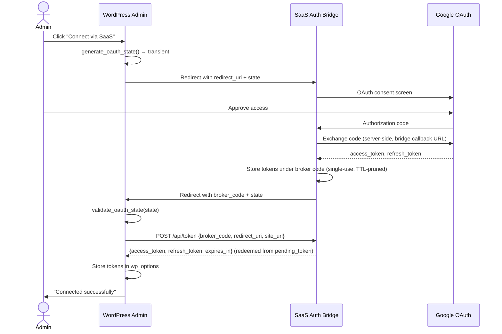
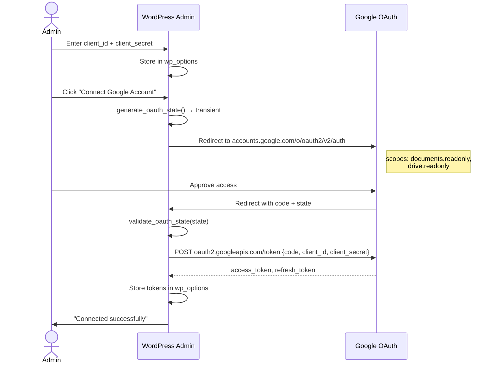

# DraftSync — System Architecture

## 1. Component Overview

```mermaid
graph TB
    subgraph "WordPress Admin"
        ADMIN_UI["Admin Settings Page<br/>GDTG_Admin::render_dashboard()"]
        OAUTH_CB["OAuth Callback Handler<br/>GDTG_Admin::handle_oauth_redirect()"]
    end

    subgraph "Gutenberg Editor"
        SIDEBAR_JS["React Sidebar<br/>src/sidebar/index.js"]
        WP_FETCH["@wordpress/api-fetch"]
    end

    subgraph "WordPress REST API"
        REST["GDTG_REST_Endpoints<br/>POST /gdtg/v1/import<br/>POST /gdtg/v1/upload-docx<br/>POST /gdtg/v1/import-bulk<br/>POST /gdtg/v1/sync/{id}<br/>GET /gdtg/v1/import/{id}/status<br/>POST /gdtg/v1/import/{id}/continue"]
        PERMS["Permission Callback<br/>check_permissions()"]
    end</input>

    subgraph "WP-CLI"
        CLI["GDTG_CLI_Command<br/>wp draftsync import<br/>wp draftsync import-docx<br/>wp draftsync status<br/>wp draftsync diagnose<br/>wp draftsync migrate-drive-sources"]
    end

    subgraph "Orchestration"
        ORCH["GDTG_Import_Orchestrator<br/>Shared parse→render→write pipeline<br/>+ Drive migration + finalize helpers"]
    end

    subgraph "Business Logic"
        API["GDTG_API<br/>Token lifecycle + HTTP<br/>+ Drive file fetch"]
        PARSER["GDTG_Parser<br/>Stateful AST builder (GDoc JSON)"]
        DOCX_PARSER["GDTG_Docx_Parser<br/>OOXML → AST (namespace-aware)"]
        ZIP_VAL["GDTG_Zip_Validator<br/>Magic bytes, traversal,<br/>nested zips, entry limits,<br/>compression ratio"]
        RENDERER["GDTG_Block_Renderer<br/>Gutenberg markup + overrides"]
        HTML_RENDERER["GDTG_HTML_Renderer<br/>Classic Editor HTML + overrides"]
        SIDELOADER["GDTG_Sideloader<br/>Image download + optimize<br/>+ sideload_from_bytes()"]
    end

    subgraph "Data Model"
        NODE["GDTG_Doc_Node<br/>Immutable AST value object"]
    end

    subgraph "External Services"
        GOOGLE["Google Docs API v1"]
        DRIVE["Google Drive API"]
        SAAS["Self-hosted OAuth Bridge<br/>Go + chi (bridge/)"]
        MEDIA["WordPress Media Library"]
    end

    subgraph "Hook Registry"
        LOADER["GDTG_Loader"]
    end

    ADMIN_UI -->|saves settings| WP_OPTIONS[(wp_options)]
    OAUTH_CB -->|stores tokens| WP_OPTIONS

    SIDEBAR_JS --> WP_FETCH
    WP_FETCH -->|POST with nonce| REST
    REST --> PERMS
    CLI --> ORCH
    REST --> ORCH

    PERMS -->|authorized| API

    API -->|SaaS mode| SAAS
    API -->|Direct OAuth mode| GOOGLE
    API -->|Drive files| DRIVE
    SAAS -->|proxies| GOOGLE

    ORCH --> PARSER
    ORCH --> DOCX_PARSER
    ORCH --> RENDERER
    ORCH --> HTML_RENDERER

    DOCX_PARSER --> ZIP_VAL

    PARSER --> NODE
    DOCX_PARSER --> NODE
    PARSER --> SIDELOADER
    SIDELOADER --> MEDIA

    ADMIN_UI -.->|registers hooks| LOADER
    REST -.->|registers hooks| LOADER
    LOADER -->|binds to| WP_HOOKS["WordPress Hook System"]
```

---

## 2. Class-by-Class Deep Dive

### 2.1 `Google_Docs_To_Gutenberg` (Main Controller)

**File:** `draftsync.php`
**Responsibility:** Bootstrap the plugin. Instantiates controller classes and runs the loader.

```php
class Google_Docs_To_Gutenberg {
    protected $loader;         // GDTG_Loader
    protected $admin;          // GDTG_Admin
    protected $rest_endpoints; // GDTG_REST_Endpoints
    protected $cli_command;    // GDTG_CLI_Command

    public function __construct();
    private function boot();   // Calls $this->loader->run()
}
```

**Lifecycle:** Instantiated on `plugins_loaded` action via `run_google_docs_to_gutenberg()`. The bootstrap function also calls `load_plugin_textdomain()` on `init` (priority 5) for `draftsync` text domain, loading `.mo` files from `languages/`.

---

### 2.2 `GDTG_Loader` (Hook Registry)

**File:** `includes/class-gdtg-loader.php`
**Responsibility:** Collect action/filter registrations and bind them to WordPress.

```php
class GDTG_Loader {
    protected $actions = [];
    protected $filters = [];

    public function add_action( $hook, $component, $callback, $priority = 10, $accepted_args = 1 );
    public function add_filter( $hook, $component, $callback, $priority = 10, $accepted_args = 1 );
    public function run();  // Iterates arrays, calls add_action/add_filter on WP
}
```

**Design:** Service classes register hooks in their constructors via `init_hooks()`, which calls `$this->loader->add_action(...)`. The main controller calls `$this->loader->run()` after all classes are instantiated.

---

### 2.3 `GDTG_Admin` (Settings & Auth)

**File:** `includes/class-gdtg-admin.php`
**Responsibility:** Admin dashboard, settings registration, OAuth callback handling, editor script enqueuing.

```php
class GDTG_Admin {
    protected $loader;

    public function __construct( $loader );
    private function init_hooks();

    // OAuth state management
    private function generate_oauth_state(): string;
    private function validate_oauth_state( $state ): bool;

    // WordPress hooks
    public function register_admin_menu();
    public function register_settings();
    public function handle_oauth_redirect();
    public function enqueue_editor_assets();
    public function render_dashboard();
}
```

**OAuth State:** 32-char cryptographic random string stored as a WordPress transient with 15-minute TTL. Single-use (deleted on validation).

---

### 2.4 `GDTG_API` (Google API Client)

**File:** `includes/class-gdtg-api.php`
**Responsibility:** Token lifecycle management and Google API requests. **v2:** added Drive file support.

```php
class GDTG_API {
    private $api_base = 'https://docs.googleapis.com/v1/documents/';

    public function get_access_token(): string|false;
    public function fetch_google_doc( $doc_id ): string|WP_Error;

    // Drive support (v2)
    public function get_drive_file_metadata( $file_id ): array|WP_Error;
    public function fetch_drive_file( $file_id ): string|WP_Error;

    // HTTP retry helpers (Phase 3)
    private function retry_get( $url, $args, $attempt = 1 );
    private function retry_post( $url, $args, $attempt = 1 );
    private function compute_429_delay( $response, $attempt );

    // Direct OAuth mode
    private function get_enterprise_access_token(): string|false;
    private function refresh_enterprise_token(): bool;

    // SaaS mode
    private function get_saas_access_token(): string|false;
    private function refresh_saas_token(): bool;

    // Utilities
    public function force_refresh_token(): string|false;
}
```

**`fetch_drive_file()`** downloads `.docx` files from Google Drive using `files.get?alt=media`, returning the raw OOXML bytes. `get_drive_file_metadata()` uses `files.get?fields=name,mimeType,modifiedTime` to validate the file is a `.docx` before downloading. Phase 3 adds `compute_429_delay()` so `retry_get()` and `retry_post()` treat HTTP 429 separately from 5xx responses, honoring `Retry-After` when present before falling back to exponential backoff. The metadata request timeout is reduced to 10 seconds so degraded Drive checks fail fast during sync and migration flows.

---

### 2.5 `GDTG_Docx_Parser` (OOXML → AST)

**File:** `includes/class-gdtg-docx-parser.php` (571 LOC)
**Responsibility:** Parse .docx OOXML files into `GDTG_Doc_Node[]` AST.

```php
class GDTG_Docx_Parser {
    private $file_path;
    private $post_id;
    private $options;

    public function __construct( $file_path, $post_id = 0, $options = array() );
    public function parse_nodes(): array;  // → GDTG_Doc_Node[]

    // Internal parsing
    private function parse_document_xml( $xml ): array;
    private function parse_paragraph( $para, $namespaces ): ?GDTG_Doc_Node;
    private function parse_run( $run, $namespaces ): string;
    private function parse_run_properties( $rPr, $namespaces ): array;
    private function parse_table( $tbl, $namespaces ): GDTG_Doc_Node;
    private function extract_text_from_node( $node, $namespaces ): string;
}
```

**Design:** Reads `word/document.xml` from the ZIP archive using `ZipArchive` (read-only, no `extractTo()`). Uses namespace-aware `SimpleXML` `children()` calls. All inline content is escaped via `esc_html()` before being placed into `$node->content`. The parser is stateless between calls — a new instance per import.

**Constraints:**
- Never uses `ZipArchive::extractTo()` — reads directly from the ZIP stream.
- Never fetches external URLs — all data comes from the local .docx file.
- OOXML namespace URIs are used for all element and attribute access.

---

### 2.6 `GDTG_Zip_Validator` (ZIP Security Hardening)

**File:** `includes/class-gdtg-zip-validator.php` (177 LOC)
**Responsibility:** Validate .docx uploads before parsing.

```php
class GDTG_Zip_Validator {
    public static function validate( $file_path ): true|WP_Error;
}
```

**Validation checks (in order):**
1. **File existence** — returns `WP_Error('cannot_open')` if file missing/unreadable.
2. **Magic bytes** — first 4 bytes must be `PK\x03\x04` (PKZIP signature) → `WP_Error('invalid_zip')`.
3. **Entry iteration** — opens ZIP, iterates all entries:
   - **Path traversal** — rejects entries containing `../`, `..\`, or absolute paths (`/`) → `WP_Error('path_traversal')`.
   - **Nested ZIPs** — rejects entries with `.zip` extension or PKZIP magic bytes in content → `WP_Error('nested_zip')`.
   - **Entry count** — rejects ZIPs with >1000 entries → `WP_Error('too_many_entries')`.
   - **Compression ratio** — rejects any entry where uncompressed/compressed > 20 → `WP_Error('compression_bomb')`.
4. Returns `true` if all checks pass.

---

### 2.7 `GDTG_Import_Orchestrator` (Shared Pipeline)

**File:** `includes/class-gdtg-import-orchestrator.php` (1060 LOC)
**Responsibility:** Wrap the full parse→render→write pipeline for REST endpoints and WP-CLI commands, including bulk row normalization and linked re-sync metadata persistence.

```php
class GDTG_Import_Orchestrator {
    public function import_google_doc( $doc_id, $options = array(), $post_id = 0 ): array|WP_Error;
    public function import_docx_file( $file_path, $file_name, $options = array(), $post_id = 0 ): array|WP_Error;
    public function import_drive_file( $file_id, $options, $post_id = 0 ): array|WP_Error;
    public function finalize_import( $post_id, $nodes, $options, $source ): array;
    public static function normalize_bulk_row_options( $row ): array|WP_Error;
    public static function classify_error( $error ): string;
}
```

**Pipeline for `import_google_doc()`:**
1. Call `GDTG_API::fetch_google_doc($doc_id)` → JSON string.
2. Create `GDTG_Parser` with JSON + post_id.
3. Call `$parser->parse_nodes()` → `GDTG_Doc_Node[]`.
4. Select renderer based on `$options['output_mode']` ('blocks' or 'html').
5. Call `$renderer->render($nodes, $overrides)` → post content string.
6. Apply post metadata if present: slug, excerpt, SEO, taxonomy, featured image, ACF, and custom meta.
7. If `$post_id` provided: `wp_update_post()`. Otherwise: `wp_insert_post()` as draft.
8. Return `array{success, post_id, title, edit_url, message}`.

**Pipeline for `import_docx_file()`:**
1. Call `GDTG_Zip_Validator::validate($file_path)`.
2. Create `GDTG_Docx_Parser` with file path + post_id + options.
3. Call `$parser->parse_nodes()` → `GDTG_Doc_Node[]`.
4. Steps 4-8 same as above.

**Drive migration path (`import_drive_file()`):**
1. Call `GDTG_API::get_drive_file_metadata($file_id)` and cache the returned MIME type on the linked post when a post ID exists.
2. If the file is already a native Google Doc, mark `_gdtg_migration_pending = 1` and hand off to `import_google_doc()` using the same options array.
3. If the file is a `.docx`, call `GDTG_API::fetch_drive_file($file_id)`, write the bytes to a temp file, and re-use `import_docx_file()` with Drive source context.
4. `finalize_import()` centralizes metadata application and sync bookkeeping so Google Doc and Drive-file imports converge on the same post-write path.

**Phase 3 sync metadata:** `record_sync_metadata()` now clears `_gdtg_migration_pending` on success. Drive-linked posts also persist `_gdtg_drive_mime_type` and `_gdtg_drive_mime_cached_at` so degraded routing can fall back to cached MIME information when Drive metadata calls fail.

**Error classification:** `classify_error()` collapses `WP_Error` values into stable buckets used by migration and scheduler reporting (`auth`, `rate_limit`, `not_found`, `timeout`, `unsupported_mime`, `network`, `unknown`).

**Bulk row normalization:** Accepts CSV/JSON rows, canonicalizes metadata fields, validates canonical URLs, and returns a shared options array for REST/CLI bulk imports.

---

### 2.8 `GDTG_Post_Meta_Applier` (Metadata Mapping)

**File:** `includes/class-gdtg-post-meta-applier.php`
**Responsibility:** Extract metadata tables from the first AST node and apply SEO, taxonomy, featured image, ACF, and guarded custom meta.

```php
class GDTG_Post_Meta_Applier {
    public function extract_metadata_table( $nodes );
    public function build_post_data( $metadata );
    public function apply( $post_id, $nodes, $metadata, $context = array() );
}
```

**Metadata behavior:**
- First-node table extraction only.
- SEO writes Yoast and RankMath keys.
- Categories/tags are resolved to taxonomy IDs.
- ACF uses `update_field()` when available.
- Custom meta is gated behind allowlist-style filters and rejects private keys by default.

---

### 2.8b `GDTG_Sync_Scheduler` (WP Cron Auto-Sync)

**File:** `includes/class-gdtg-sync-scheduler.php` (~287 LOC)
**Responsibility:** Periodically re-import linked posts whose Drive sources have changed. Shared runner for CLI `wp draftsync sync-all`.

```php
class GDTG_Sync_Scheduler {
    const HOOK = 'gdtg_auto_sync_event';
    const PER_POST_TIMEOUT = 90;

    public function __construct( $loader );
    private function init_hooks();

    // WP Cron management
    public function add_cron_schedules( $schedules );
    public function maybe_reschedule();
    public function ensure_scheduled();
    public function clear_scheduled();

    // Core runner (shared by WP Cron and CLI sync-all)
    public function run_scheduled_sync( $limit = 0, $force = false, $dry_run = false ): array;
}
```

**Detection pipeline:**
1. Query all posts with `_gdtg_auto_sync = 1` and `_gdtg_source_type IN (gdoc, drive_file)`.
2. For each post, fetch Drive file metadata via `GDTG_API::get_drive_file_metadata()`.
3. Compare `modifiedTime` against stored `_gdtg_source_modified_time`.
4. If changed or `$force` is set: re-import via `GDTG_Import_Orchestrator`.
5. If content hash conflicts with local edits: skip (or force-override if `$force`).
6. Return summary: `{checked, synced, skipped, conflicts, failed, migrated, timeouts, dry_run}`.

**Timeout guard:** Phase 3 adds `PER_POST_TIMEOUT` (90 seconds). `run_scheduled_sync()` measures each post import, and if processing exceeds the guard it increments `timeouts` and records a `timeout` status in the per-post detail payload so one pathological source does not disappear into the generic failure bucket.

**WP Cron:** Registered on `gdtg_auto_sync_event` hook. Frequency configurable (hourly, twice-daily, daily) via `gdtg_auto_sync_frequency` option. Idempotent — `maybe_reschedule()` on `admin_init` ensures the event exists when enabled and is removed when disabled.

---

### 2.9 `GDTG_CLI_Command` (WP-CLI Integration)

**File:** `includes/class-gdtg-cli-command.php` (826 LOC)
**Responsibility:** Register `wp draftsync` commands.

```php
class GDTG_CLI_Command {
    // wp draftsync import <url> [--post_id=] [--post_type=] [--draft] [--output=blocks|html]
    //   [--heading-demotion=] [--min-heading-level=] [--default-alignment=]
    public function import( $args, $assoc_args );

    // wp draftsync import-docx <path> [same options as import]
    public function import_docx( $args, $assoc_args );

    // wp draftsync import-bulk <file>
    public function import_bulk( $args, $assoc_args );

    // wp draftsync sync <post_id>
    public function sync( $args, $assoc_args );

    // wp draftsync status [job_id] [--all]
    public function status( $args, $assoc_args );

    // wp draftsync sync-all [--limit=] [--force] [--dry-run]
    public function sync_all( $args, $assoc_args );

    // wp draftsync migrate-drive-sources [--dry-run] [--post-id=] [--limit=]
    public function migrate_drive_sources( $args, $assoc_args );

    // wp draftsync diagnose [--post-id=] [--limit=]
    public function diagnose( $args, $assoc_args );
}
```

All import commands delegate to `GDTG_Import_Orchestrator`. The `status` command reads transient-based job tracking. Phase 3 adds `migrate_drive_sources` for bulk auto-migration of linked Drive `.docx` sources that have become native Google Docs, and `diagnose` for surfacing migration state, cached MIME type, and source linkage across linked posts.


### 2.9b Sync Locking and Queued Sync

DraftSync uses per-post mutex locking to prevent duplicate concurrent sync work:

**`GDTG_Sync_Lock`** (`includes/class-gdtg-sync-lock.php`):

```php
class GDTG_Sync_Lock {
    const GROUP = 'gdtg_sync_lock';
    const TTL   = 300; // 5 minutes

    public static function acquire( $post_id ): bool;
    public static function release( $post_id ): bool;
    public static function is_locked( $post_id ): bool;
    public static function heartbeat( $post_id ): bool;
}
```

**Lock semantics:**
- Backed by per-post options (`gdtg_sync_lock_{post_id}`). `add_option()` provides the initial atomic INSERT claim.
- When a stale lock row exists, DraftSync overwrites the expired timestamp in place instead of delete-then-add, avoiding the obvious lock-theft window.
- `acquire()` blocks when the stored expiry is still in the future.
- `heartbeat()` extends the lock TTL from long-running scheduler, REST sync, import, and queued-sync paths.
- `release()` cleans up the lock. Safe to call on never-locked posts.
- `is_locked()` checks whether a post is currently locked.

**Queued sync path:**
When a lock cannot be acquired immediately (e.g. a cron sync is in progress), the REST handler returns HTTP 423. When a sync is queued intentionally, DraftSync schedules a one-shot WP Cron event on the `gdtg_run_queued_sync` hook and deduplicates with `wp_next_scheduled()`.

**423 Locked response:**
`POST /gdtg/v1/sync/{post_id}/queue` and sync/import routes return HTTP 423 Locked when the post lock is already held.

### 2.9c OAuth Secret Encryption

**`GDTG_Secret_Store`** (`includes/class-gdtg-secret-store.php`):

```php
class GDTG_Secret_Store {
    public static function encrypt( $plaintext ): string|WP_Error;
    public static function decrypt( $ciphertext ): string|WP_Error;
    public static function set( $option_key, $value ): bool;
    public static function get( $option_key ): string|WP_Error;
    public static function migrate_option( $option_key ): bool;
}
```

**Encryption details:**
- AES-256-GCM via OpenSSL (`openssl_encrypt` / `openssl_decrypt` with `aes-256-gcm` cipher).
- Key derived from `wp_salt('auth')` using SHA-256 (`hash('sha256', $salt, true)`).
- Per-value random 128-bit IV stored alongside ciphertext in a JSON envelope: `{iv, tag, ct}`.
- `encrypt()` produces a unique ciphertext for every call, even for identical plaintext.
- `decrypt()` validates the GCM authentication tag — tampered or corrupted ciphertext returns `WP_Error('decrypt_failed')`.

**Storage contract:**
- `set($key, $v)` encrypts `$v` and stores it in `wp_options` under `$key`.
- `get($key)` decrypts the stored value. Returns `WP_Error` on integrity failure; falls back to returning the raw option value when the stored value is not a valid envelope (backward compat with legacy plaintext).
- `migrate_option($key)` detects legacy plaintext values and encrypts them in-place. Already-encrypted values are a no-op.
- Used by `gdtg_enterprise_client_secret` — never stored plaintext after migration.

### 2.9d Drive Browser

DraftSync uses the **Google Picker API** instead of building a custom Drive file tree. The picker launches from the Gutenberg sidebar next to the existing URL input.

**Picker config endpoint:** `GET /gdtg/v1/picker/config`
- Without picker keys (App ID + Developer Key): returns `{enabled: false, reason: "missing_keys"}`.
- With `gdtg_picker_app_id` + `gdtg_picker_developer_key`: returns `{enabled: true, app_id, developer_key, scopes: ["docs.readonly", "drive.readonly"]}`.
  Requires an active Google connection (SaaS or Direct OAuth) to obtain an access token.

**Picker token endpoint:** `GET /gdtg/v1/auth/token?purpose=picker`
- Returns the current access token for Picker API authentication.
- Rate-limited to 5 requests per minute per user.
- Never exposes the refresh token.

**Sidebar integration:**
- A "Choose from Google Drive" button appears next to the URL input when picker config returns `enabled: true`.
- Selected file metadata (`id`, `name`, `url`, `mimeType`) feeds into the existing import flow — no new pipeline.
- Manual URL/ID input remains available as a fallback for all modes.
---

### 2.10 `GDTG_REST_Endpoints` (API Layer)

**File:** `includes/class-gdtg-rest-endpoints.php`
**Responsibility:** Register and handle REST API routes.

```php
class GDTG_REST_Endpoints {
    protected $loader;

    public function __construct( $loader );
    private function init_hooks();
    public function register_routes();
    public function check_permissions( $request ): bool|WP_Error;
    public function handle_import( $request ): WP_REST_Response;
    public function handle_upload_docx( $request ): WP_REST_Response;
    public function handle_import_bulk( $request ): WP_REST_Response;
    public function handle_sync_status( $request ): WP_REST_Response;
    public function handle_sync_settings( $request ): WP_REST_Response;
    public function handle_sync_run( $request ): WP_REST_Response;
    public function handle_job_status( $request ): WP_REST_Response;
    public function handle_job_continue( $request ): WP_REST_Response;
    public function handle_resync( $request ): WP_REST_Response;
    public function parse_source_reference( $input ): array|WP_Error;
    private function extract_doc_id( $input ): string|WP_Error;
}
```

**Coverage note:** All import flows (Google Doc URL, .docx upload/dropzone, Drive .docx, bulk import, linked re-sync, sync auto-sync) route through the shared orchestrator. The sidebar exposes all controls: .docx dropzone, style overrides, metadata, and linked re-sync. Sync scheduler routes (status, settings, run) are admin-only.

---

### 2.9 `GDTG_Parser` (Stateful AST Builder — GDoc JSON)

**File:** `includes/class-gdtg-parser.php` (566 LOC)
**Responsibility:** Translate Google Docs JSON into `GDTG_Doc_Node[]` AST.

```php
class GDTG_Parser {
    private $document;           // Decoded JSON array
    private $inline_objects;     // Image/drawing map
    private $post_id;            // For media sideloading
    private $list_stack = [];    // Nesting state for lists
    private $list_is_ordered;
    private $pending_list_flush;

    public function __construct( $doc_json_string, $post_id = 0 );
    public function parse(): string;             // → Gutenberg HTML
    public function parse_nodes(): array;        // → GDTG_Doc_Node[]

    private function parse_paragraph( $paragraph ): array;
    private function push_list_item( $paragraph );
    private function flush_list_stack( &$nodes );
    private function build_image_node( $image_id ): ?GDTG_Doc_Node;
    private function parse_table( $table ): ?GDTG_Doc_Node;
    private function compile_cell_content( $cell_content ): string;
    private function compile_elements( $elements ): string;
    private function is_list_ordered( $list_id ): bool;
    private function rgb_to_hex( $rgb ): string;
}
```

---

### 2.10 `GDTG_Doc_Node` (AST Value Object)

**File:** `includes/class-gdtg-doc-node.php`
**Responsibility:** Immutable data container for parsed document nodes.

```php
class GDTG_Doc_Node {
    public $type;      // string — 'paragraph', 'heading', 'image', 'list', etc.
    public $content;   // string — Pre-escaped inline HTML
    public $attrs;     // array  — Key-value attributes
    public $children;  // GDTG_Doc_Node[] — Child nodes

    public function __construct( $type, $content = '', $attrs = [], $children = [] );
}
```

---

### 2.11 `GDTG_Block_Renderer` (Stateless Markup Emitter)

**File:** `includes/class-gdtg-block-renderer.php`
**Responsibility:** Walk the AST and produce Gutenberg block HTML. **v2:** accepts `$overrides`.

```php
class GDTG_Block_Renderer {
    public function render( $nodes, $overrides = array() ): string;

    private function render_node( $node ): string;
    private function render_paragraph( $node ): string;
    private function render_heading( $node ): string;
    private function render_image( $node ): string;
    private function render_list( $node ): string;
    private function render_list_item( $node ): string;
    private function render_nested_list_inner( $node ): string;
    private function render_table( $node ): string;
}
```

**Style overrides** (`$overrides` array):

| Key | Type | Default | Effect |
|---|---|---|---|
| `heading_demotion` | int 0-5 | 0 | Drop all heading levels by N (H3 → H4 if N=1) |
| `min_heading_level` | int 1-6 | 1 | Cap minimum heading level (H1/H2 → H3 if min=3) |
| `default_alignment` | `'left'|'center'|'right'` | none | Force alignment on paragraphs without explicit alignment |

---

### 2.12 `GDTG_HTML_Renderer` (Classic Editor Output)

**File:** `includes/class-gdtg-html-renderer.php`
**Responsibility:** Walk the AST and produce Classic Editor HTML. **v2:** accepts `$overrides`.

```php
class GDTG_HTML_Renderer {
    public function render( $nodes, $overrides = array() ): string;
    private function render_node( $node ): string;
}
```

---

### 2.13 `GDTG_Sideloader` (Image Pipeline)

**File:** `includes/class-gdtg-sideloader.php`
**Responsibility:** Download remote images and register them in the WordPress Media Library. **v2:** added `sideload_from_bytes()`.

```php
class GDTG_Sideloader {
    public static function sideload( $url, $post_id = 0, $desc = '' ): int|false;
    public static function sideload_from_bytes( $bytes, $filename, $post_id = 0, $alt = '', $options = array() ): int|false;
    private static function optimize_attachment( $attachment_id );
}
```

**Pipeline:**
1. Validate URL scheme (`http`/`https` only) — for `sideload()`.
2. Require WordPress admin media functions.
3. Call `media_sideload_image()` or `wp_upload_bits()` + `wp_insert_attachment()`.
4. If `gdtg_optimize_images` is enabled: resize, compress to 82% quality, convert to WebP.
5. Return attachment ID or `false`.

---

### 2.14 `GDTG_REST_Endpoints` (API Layer)

**File:** `includes/class-gdtg-rest-endpoints.php`
**Responsibility:** Register and handle REST API routes. **v2:** added upload-docx, job status/continue, parse_source_reference.

```php
class GDTG_REST_Endpoints {
    protected $loader;

    public function __construct( $loader );
    private function init_hooks();
    public function register_routes();
    public function check_permissions( $request ): bool|WP_Error;
    public function handle_import( $request ): WP_REST_Response;
    public function handle_upload_docx( $request ): WP_REST_Response;
    public function handle_job_status( $request ): WP_REST_Response;
    public function handle_job_continue( $request ): WP_REST_Response;
    public function parse_source_reference( $input ): array|WP_Error;
    private function extract_doc_id( $input ): string|WP_Error;
}
```

**`parse_source_reference($input)`** routes input to the correct parser:

| Input Pattern | Return | Parser Used |
|---|---|---|
| Google Doc URL or ID | `array('type' => 'gdoc', 'id' => $doc_id)` | `GDTG_Parser` |
| Google Drive file URL | `array('type' => 'drive_file', 'id' => $file_id)` | `GDTG_Docx_Parser` via `GDTG_API::fetch_drive_file()` |
| Other | `WP_Error` | — |

---

## 3. Request Lifecycle

### Google Doc Import Flow

```
1. User pastes Google Doc URL in Gutenberg sidebar
2. User clicks "Import Now"
3. JS sends POST /gdtg/v1/import {doc_id, post_id, options}
4. WordPress verifies nonce (wp_rest)
5. GDTG_REST_Endpoints::check_permissions()
   → If post_id: current_user_can('edit_post', post_id)
   → If no post_id: current_user_can('edit_posts')
6. GDTG_REST_Endpoints::handle_import()
   a. parse_source_reference(doc_id) → type: gdoc
   b. Call GDTG_Import_Orchestrator::import_google_doc(doc_id, options, post_id)
      → GDTG_API::fetch_google_doc(doc_id)
      → GDTG_Parser::parse_nodes() → GDTG_Doc_Node[]
      → GDTG_Block_Renderer::render(nodes, overrides) → HTML
      → wp_update_post() or wp_insert_post()
7. REST response: {success, post_id, title, edit_url, message}
```

### Drive .docx Import Flow

```
1. parse_source_reference(drive_url) → type: drive_file
2. GDTG_Import_Orchestrator::import_google_doc() detects drive_file type
3. GDTG_API::get_drive_file_metadata(file_id) validates .docx MIME type
4. GDTG_API::fetch_drive_file(file_id) downloads raw OOXML bytes
5. Write bytes to temp file
6. GDTG_Zip_Validator::validate(temp_path)
7. GDTG_Docx_Parser(temp_path, post_id, options)::parse_nodes() → GDTG_Doc_Node[]
8. Renderer + post save (same as GDoc flow)
```

### .docx Upload Flow

```
1. User uploads .docx via POST /gdtg/v1/upload-docx (multipart)
2. WordPress parses multipart, stores file in temp dir
3. GDTG_REST_Endpoints::check_permissions()
4. GDTG_REST_Endpoints::handle_upload_docx()
   a. Validate file extension (.docx)
   b. Call GDTG_Import_Orchestrator::import_docx_file(file_path, file_name, options, post_id)
      → GDTG_Zip_Validator::validate(file_path)
      → GDTG_Docx_Parser(file_path, post_id, options)::parse_nodes() → GDTG_Doc_Node[]
      → GDTG_Block_Renderer::render(nodes, overrides) → HTML
      → wp_update_post() or wp_insert_post()
5. Cleanup temp file
6. REST response: {success, post_id, title, edit_url, message}
```
### Bulk Import Flow

```
1. User adds rows in sidebar or sends POST /gdtg/v1/import-bulk {rows, dry_run}
2. GDTG_REST_Endpoints::handle_import_bulk()
   a. Validate row count (max 100)
   b. For each row: normalize_bulk_row_options() → options array
   c. If dry_run: validate only, report pass/fail per row
   d. Otherwise: call import_google_doc() for gdoc, import_docx_file() for upload
3. Return {success, summary: {success, failed}, results[]}
```

### Linked Re-Sync Flow

```
1. User clicks "Re-Sync" in sidebar or sends POST /gdtg/v1/sync/{post_id}
2. GDTG_REST_Endpoints::handle_resync()
   a. Query post meta: _gdtg_source_url, _gdtg_source_type, _gdtg_content_hash
   b. Compare stored hash against current post_content hash
   c. If conflict && !force: return error "Post has been modified locally"
   d. Parse source URL → doc_id or file_id
   e. Call GDTG_Import_Orchestrator::import_google_doc() / import_docx_file()
3. Return {success, post_id, title, edit_url, message}
```

### Auto-Sync (WP Cron) Flow

```
1. WP Cron triggers gdtg_auto_sync_event
2. GDTG_Sync_Scheduler::run_scheduled_sync(limit, force, dry_run)
   a. Query posts with _gdtg_auto_sync = 1, _gdtg_source_type IN (gdoc, drive_file)
   b. For each post:
      - Fetch Drive file metadata via GDTG_API::get_drive_file_metadata()
      - Compare modifiedTime against _gdtg_source_modified_time
      - If changed or force: re-import via orchestrator
      - If conflict: skip (or force-override)
3. Update _gdtg_last_sync_run option
4. Return summary: {checked, synced, skipped, conflicts, failed, dry_run}
```

### WP-CLI Import Flow

```
1. wp draftsync import <url> [options]
2. GDTG_CLI_Command::import()
   a. Map assoc_args to options array
   b. Call GDTG_Import_Orchestrator::import_google_doc(doc_id, options, post_id)
   c. On success: WP_CLI::success("Post created: {edit_url}")
   d. On error: WP_CLI::error(error_message)
```

---

## 4. .docx Parsing Pipeline

```
┌─────────────────────────────────────────────────────────────────┐
│                    .docx PARSING PIPELINE                        │
│                                                                  │
│  .docx file (ZIP container)                                      │
│       │                                                          │
│       ▼                                                          │
│  ┌────────────────────┐                                          │
│  │ GDTG_Zip_Validator  │  Security gate                         │
│  │                     │  • Magic bytes (PK\x03\x04)            │
│  │                     │  • No path traversal (../ or /)        │
│  │                     │  • No nested ZIPs                      │
│  │                     │  • ≤1000 entries                       │
│  │                     │  • Compression ratio ≤20x              │
│  └────────┬───────────┘                                          │
│           │ true (pass)                                           │
│           ▼                                                      │
│  ┌────────────────────┐                                          │
│  │ GDTG_Docx_Parser    │  ZipArchive open (read-only)            │
│  │                     │  Extract word/document.xml              │
│  │                     │  SimpleXML with namespace registration  │
│  │                     │  Iterate w:body children                │
│  │                     │  Parse w:p (paragraphs, headings)       │
│  │                     │  Parse w:tbl (tables)                   │
│  │                     │  Parse w:r → w:t (text runs)            │
│  │                     │  Parse rPr (bold, italic, color, etc.)   │
│  │                     │  Compile inline HTML with esc_html()    │
│  └────────┬───────────┘                                          │
│           │                                                      │
│           ▼                                                      │
│  ┌────────────────┐                                              │
│  │ GDTG_Doc_Node[] │  Shared AST                                │
│  └──────┬─────────┘                                              │
│         │                                                        │
│         ▼                                                        │
│  ┌──────────────────────┐   ┌─────────────────────┐              │
│  │ GDTG_Block_Renderer   │   │ GDTG_HTML_Renderer   │              │
│  │ (+ style overrides)   │   │ (+ style overrides)  │              │
│  └──────────────────────┘   └─────────────────────┘              │
└─────────────────────────────────────────────────────────────────┘
```

---

## 5. OAuth Flow Diagrams

### 5.1 SaaS Mode



### 5.2 Direct OAuth Mode



---

## 6. Image Pipeline

### From Google Docs (sideload from URL)

```
Parser encounters inlineObjectElement
  → GDTG_Sideloader::sideload(contentUri)
  → media_sideload_image() downloads from Google's CDN
  → Attaches to post_id
  → Optional: optimize_attachment() (resize, compress, WebP)
  → Returns attachment_id
  → Parser builds GDTG_Doc_Node('image', '', {id, url, alt})
```

### From .docx (sideload from bytes)

```
Docx_Parser encounters w:drawing → extract image rId
  → Read image bytes from ZipArchive (word/media/imageN.png)
  → GDTG_Sideloader::sideload_from_bytes(bytes, filename, post_id, alt)
  → wp_upload_bits() + wp_insert_attachment()
  → Returns attachment_id
  → Parser builds GDTG_Doc_Node('image', '', {id, url, alt})
```

### Failure Handling

If sideloading fails (network timeout, invalid URL, file type mismatch):
- `GDTG_Sideloader::sideload()` returns `false`
- `build_image_node()` returns `null`
- The image is silently omitted from the output
- No error is surfaced to the user (non-blocking)

---

## 7. Shared Hosting Resilience

Current measures:

| Measure | Implementation |
|---|---|
| HTTP timeout | `wp_remote_get` with 30s timeout for doc fetch, 15s for OAuth |
| Token refresh | Automatic — detects 401 responses, refreshes, retries |
| Image sideloading | Uses WordPress `media_sideload_image()` which handles download errors gracefully |
| Memory | Parser processes one element at a time — no full-document string copies |
| ZIP safety | `GDTG_Zip_Validator` prevents resource exhaustion from malicious .docx files |
| Temp file cleanup | .docx upload temp files cleaned after import succeeds or fails |

---

## 8. Frontend-Backend Communication

### JS → PHP

```javascript
// Google Doc / Drive URL import
apiFetch({
    path: '/wp-json/gdtg/v1/import',  // From GDTG_Settings.rest_url
    method: 'POST',
    data: {
        doc_id: 'https://docs.google.com/document/d/XXX/edit',
        post_id: 42,  // Current post ID from GDTG_Settings.post_id
        import_images: true,
        import_tables: true,
        overwrite: false,
        import_as_draft: true,
        output_mode: 'blocks',
        heading_demotion: 1,
        min_heading_level: 3,
        default_alignment: 'left',
        post_meta: { slug: 'my-slug', excerpt: '...', seo_title: '...' },
    }
});

// .docx file upload (multipart)
const formData = new FormData();
formData.append('file', docxFile);
formData.append('post_id', '42');
formData.append('options', JSON.stringify({
    import_images: true,
    import_as_draft: true,
}));
apiFetch({ path: '/wp-json/gdtg/v1/upload-docx', method: 'POST', body: formData });

// Bulk import
apiFetch({
    path: '/wp-json/gdtg/v1/import-bulk',
    method: 'POST',
    data: { rows: [{ source: 'https://docs.google.com/...' }, { source: 'https://...' }], dry_run: false },
});

// Linked re-sync
apiFetch({
    path: `/wp-json/gdtg/v1/sync/${postId}`,
    method: 'POST',
    data: { force: false },
});
```

> **Note:** The sidebar exposes .docx upload with drag-and-drop, style override controls, publishing metadata, bulk import, and linked re-sync with conflict detection. All REST API params are accepted and wired.

---

## 9. State Management

### Parser State

Both parsers are **stateful during a single parse call**. State is held in instance properties:

| Property | Parser | Purpose |
|---|---|---|
| `$document` | GDTG_Parser | Decoded JSON |
| `$inline_objects` | GDTG_Parser | Image/drawing map |
| `$post_id` | Both | Media attachment target |
| `$list_stack` | Both | Nested list accumulator |
| `$file_path` | GDTG_Docx_Parser | .docx file path |
| `$options` | GDTG_Docx_Parser | Parser options |

A new parser instance is created per import — no shared state between requests.

### Orchestrator State

`GDTG_Import_Orchestrator` is **stateless** — each method call is independent. It creates parser and renderer instances internally per call.

### Sync Scheduler State

`GDTG_Sync_Scheduler` is **stateless** — the scheduler reads options at invocation time and delegates to the orchestrator. WP Cron registration is idempotent via `maybe_reschedule()` on `admin_init`.

### React State

The sidebar uses a flat state model with `useState`. All UI controls (.docx dropzone, style overrides, metadata, re-sync) are wired and functional.

DraftSync uses **WordPress `wp_options` table only** — no custom tables.

All data is stored via `register_setting()` + `update_option()` / `get_option()`. See the options table in `docs/codebase-summary.md` for the full list.

**Transients used:**

| Transient Key | TTL | Purpose |
|---|---|---|
| `gdtg_oauth_state_{state}` | 15 minutes | CSRF protection for OAuth callbacks |
| `gdtg_import_job_{job_id}` | 1 hour | Batch import job state |

---

## 11. External Dependencies

### Runtime

| Dependency | Version | Purpose |
|---|---|---|
| WordPress | 6.0+ | Platform |
| PHP | 7.4+ | Server runtime |
| Google Docs API v1 | — | Document fetching |
| Google Drive API v3 | — | .docx file download (v2) |
| PHP Zip extension | — | .docx parsing (built-in, no Composer) |
| PHP SimpleXML extension | — | OOXML parsing (built-in, no Composer) |

### Build

| Dependency | Version | Purpose |
|---|---|---|
| `@wordpress/scripts` | ^27.0.0 | Webpack build tooling for Gutenberg JS |
| Node.js | 16+ | Build runtime |
| pnpm | 8.14.2 | Package manager (preferred) |

### WordPress APIs Used

| API | Purpose |
|---|---|
| `wp_remote_get()` / `wp_remote_post()` | HTTP requests to Google APIs |
| `media_sideload_image()` | Image download to Media Library |
| `wp_upload_bits()` / `wp_insert_attachment()` | .docx image sideloading |
| `wp_insert_post()` / `wp_update_post()` | Post creation/update |
| `register_setting()` | Settings registration |
| `wp_create_nonce()` / `check_admin_referer()` | CSRF protection |
| `set_transient()` / `get_transient()` / `delete_transient()` | OAuth state + job tracking |
| `wp_enqueue_script()` / `wp_localize_script()` | Frontend asset loading |
| `register_rest_route()` | REST API registration |
| `WP_CLI::add_command()` | WP-CLI command registration |

### SaaS OAuth Bridge (Self-Hosted)

The managed SaaS auth bridge (`saas-bridge.draftsync.com`) has been
replaced by a self-hosted Go + chi OAuth broker under `bridge/`. Deployment target:
Proxmox LXC with Caddy + systemd.

The bridge acts as an OAuth broker — it holds the Google `client_secret` centrally and
issues real Google access/refresh tokens to the plugin. The plugin calls Google APIs
directly; no document or image traffic flows through the bridge.

**Broker-code flow**: `/api/callback` exchanges the Google authorization code
server-side, stores the token bundle under a random broker code (single-use,
TTL-pruned in SQLite), and redirects the plugin with that broker code. `/api/token`
redeems the broker code — it never calls Google directly. The raw Google code is
never exposed to the plugin.

**Bridge base URL resolution** (in plugin):
1. `GDTG_SAAS_BRIDGE_BASE_URL` constant (wp-config.php override)
2. `gdtg_saas_bridge_base_url` option (programmatic)
3. `GDTG_SAAS_BRIDGE_BASE_URL_DEFAULT` constant (packaged fallback)

Each source is validated by `GDTG_API::validate_bridge_url()`: HTTPS required,
no userinfo, non-empty host, localhost/http allowed only for dev.

The DNS guard `GDTG_Admin::is_saas_bridge_available()` checks the configured host
with a host-scoped transient key.
When the bridge is unreachable, the "Connect Google Account" CTA is suppressed with
a public-safe "temporarily unavailable" state.

Full contract: `docs/contracts/oauth-bridge-contract.md`

Full LXC runbook: `bridge/deploy/README.md`
